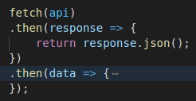

# Weather App
Using geographical location from computer finds out the weather information using OpenWeather API.

[Followed this tutorial](https://www.youtube.com/watch?v=wPElVpR1rwA&t=1814s)

---
Key things learned!

1. HTML navigator.geolocation
    - retrieve lon and lat position coordinates

2. Using OpenWeatherApi
    - generating my key and then getting appropriate API link to link with coordinates
    - using fetch function to perform API call

3. Manipulate DOM objects
